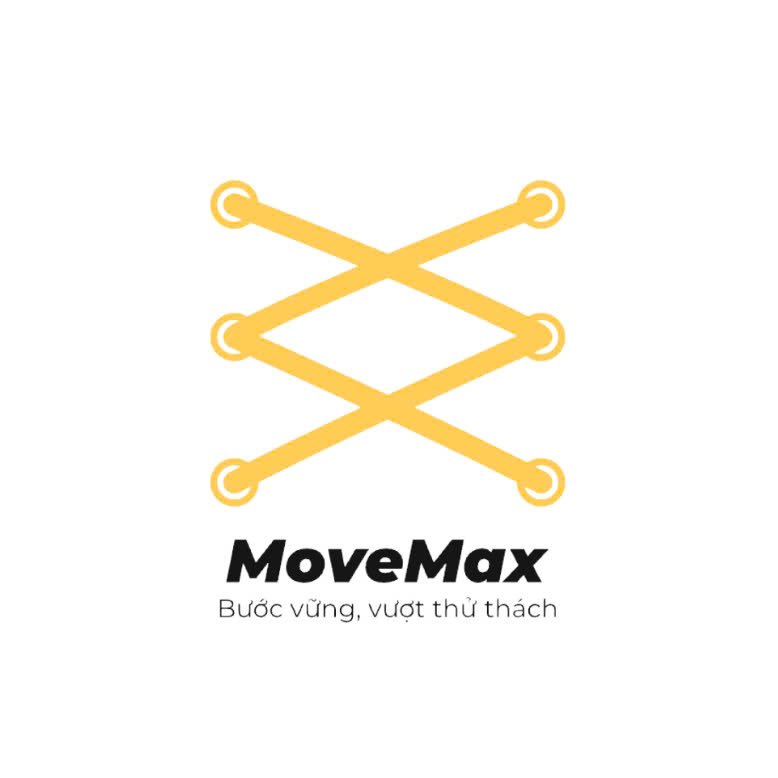

## GIỚI THIỆU ĐỒ ÁN

-    **Đề tài:** Website bán giày thể thao - MoveMax
-    **Y nghia logo:** Hình ảnh trung tâm của logo là hình ảnh dây giày, là một phần không thể thiếu của giày thể thao. Hình ảnh dây giày nhìn một cách trừu tượng sẽ thấy được 2 chữ M đối nhau và chữ M ở đây tượng trưng cho tên thương hiệu.
-    **Y nghia tên thương hiệu :** Tên thương hiệu "MoveMax" kết hợp giữa "Move" (di chuyển) và "Max" (tối đa), thể hiện ý chí vươn tới giới hạn, di chuyển tối đa, hoặc đạt được hiệu suất cao nhất.
-    **Y nghia slogan:** Khẩu hiệu này củng cố thêm ý nghĩa của logo, nhấn mạnh sự kiên định, vững chắc trong từng bước đi, và tinh thần chinh phục, vượt qua mọi khó khăn, thử thách.

-    **Ý nghĩa logo:** Hình ảnh trung tâm của logo là hình ảnh dây giày, là một phần không thể thiếu của giày thể thao. Hình ảnh dây giày nhìn một cách trừu tượng sẽ thấy được 2 chữ M đối nhau và chữ M ở đây tượng trưng cho tên thương hiệu.
-    **Ý nghĩa tên thương hiệu :** Tên thương hiệu "MoveMax" kết hợp giữa "Move" (di chuyển) và "Max" (tối đa), thể hiện ý chí vươn tới giới hạn, di chuyển tối đa, hoặc đạt được hiệu suất cao nhất.
-    **Ý nghĩa slogan:** Khẩu hiệu này củng cố thêm ý nghĩa của logo, nhấn mạnh sự kiên định, vững chắc trong từng bước đi, và tinh thần chinh phục, vượt qua mọi khó khăn, thử thách.
-    **Repository Sourcecode:** [Phát triển ứng dụng web](https://github.com/22521464/MoveMax-Shoes)

## THÀNH VIÊN NHÓM

| STT | MSSV     | Họ và Tên            | Email                  |
| :-- | :------- | :------------------- | :--------------------- |
| 1   | 22521305 | Nguyễn Duy Tân       | 22521305@gm.uit.edu.vn |
| 2   | 22521464 | Giang Mỹ Tiên        | 22521464@gm.uit.edu.vn |
| 3   | 22521510 | Huỳnh Ngọc Trang     | 22521510@gm.uit.edu.vn |
| 4   | 22520895 | Vũ Tuấn Minh         | 22520895@gm.uit.edu.vn |
| 5   | 22521422 | Phan Duy Thọ         | 22521422@gm.uit.edu.vn |

To run the MoveMax ecommerce web application locally, please follow these steps:

1. git clone https://github.com/22521464/MoveMax-Shoes
2. cd MoveMax-Shoes
3. npm install
4. npm start

